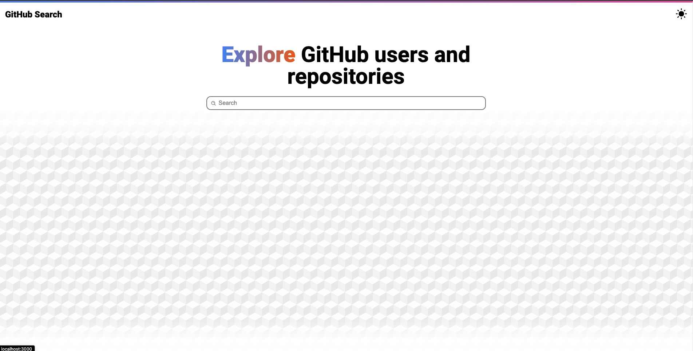

# GitHub Client

## Built with React & TypeScript & Apollo Client & GitHub GraphQL API

### Search GitHub users, explore their repos, create issues

## Getting Started

Get your Github creadentials by using [this guide](https://docs.github.com/en/authentication/keeping-your-account-and-data-secure/creating-a-personal-access-token).

Create a .env file on the root and put your credentials. (You can edit the .env.example file)

In the project directory run:

### `yarn`

Installs dependencies

### `yarn start`

Runs the app in the development mode.\
Open [http://localhost:3000](http://localhost:3000) to view it in the browser.

The page will reload if you make edits.\
You will also see any lint errors in the console.
